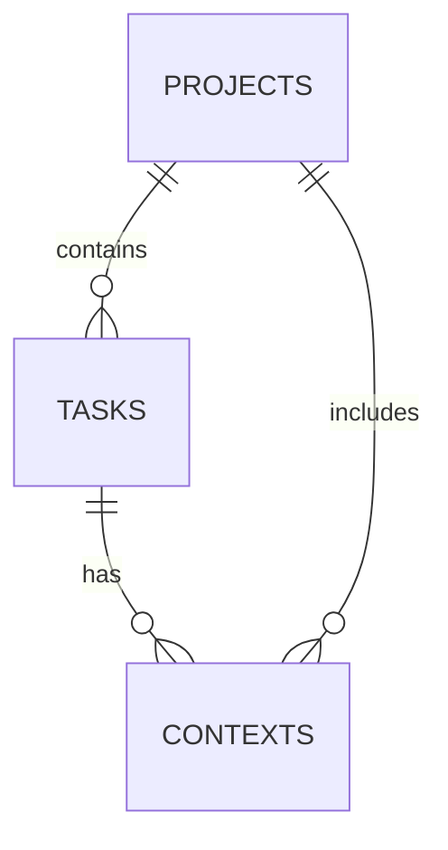

# On Task


## A powerful task management extension for Visual Studio Code and compatible derivatives

[Features](#features) • [Installation](#installation) • [Usage](#usage) • [MCP Integration](#mcp-integration) • [Development](#development) • [License](#license)

## Overview

On Task is a comprehensive task management extension designed for Visual Studio Code and compatible derivatives. Built with TypeScript, it offers an integrated MCP (Model Context Protocol) server and SQLite database to provide a seamless task management experience directly within your development environment.

The extension organizes work through a hierarchical structure:

- **Projects**: Container for related tasks
- **Tasks**: Work items that belong to a project
- **Contexts**: Specific contexts for tasks (e.g., code snippets, notes)

Each context is linked to a specific task, while tasks can have multiple contexts or none at all.

## Features

### Intuitive User Interface

On Task provides a clean, intuitive interface directly within VS Code:

- **Project Explorer**: Browse and manage all your projects
- **Task Management**: View, create, and update tasks with visual status indicators
- **Context Panel**: Manage contextual information linked to specific tasks
- **Form-based Editing**: User-friendly forms for all operations

### Core Functionality

#### Project Management

- Create and organize projects to group related tasks
- Add descriptions and metadata to projects
- Clean up and archive completed projects

#### Task Management

- Create tasks with project associations
- Toggle task status (pending/done) with a single click
- Prioritize and sort tasks based on various criteria
- Filter tasks by status, context, or custom parameters

#### Context Management

- Link specific contexts (code snippets, notes, references) to tasks
- Organize and retrieve task-specific information efficiently
- Edit and update contexts as tasks evolve

### MCP Server Integration

- Programmatic access to all On Task functionality
- Seamless integration with the Windsurf MCP ecosystem
- One-click installation of MCP server configuration
- Dedicated management panel for MCP server settings

### Additional Features

- Efficient search functionality across projects, tasks, and contexts
- Progress tracking and task statistics
- Keyboard shortcuts for common operations
- SQLite database for reliable data persistence

## Installation

### From VS Code Marketplace

```bash
code --install-extension on-task
```

Or install through the VS Code Extensions panel:

1. Open VS Code
2. Press `Ctrl+Shift+X` (Windows/Linux) or `Cmd+Shift+X` (macOS) to open the Extensions panel
3. Search for "On Task"
4. Click **Install**
5. Reload VS Code when prompted

### For VS Code Derivatives

On Task is compatible with VS Code derivatives such as VSCodium, Theia, and others:

1. Open your VS Code-based editor
2. Navigate to the extensions marketplace (typically `Ctrl+Shift+X`)
3. Search for "On Task"
4. Install and reload as prompted

### Manual Installation

If the extension is not available in your editor's marketplace:

1. Download the `.vsix` file from the [Releases](https://github.com/maiks1986/on-task/releases) page
2. In your editor, open Extensions
3. Click on the `...` menu (or equivalent)
4. Select **Install from VSIX...**
5. Navigate to the downloaded file and install

## Usage

### Getting Started

1. Open the On Task sidebar by clicking the On Task icon in the activity bar
2. Create your first project by clicking the **+** button in the Projects section
3. Add tasks to your project by clicking the **+** button in the Tasks section
4. Add contexts to tasks by selecting a task and clicking the **+** button in the Contexts section

### Managing Projects

- **Create Project**: Click the **+** button in the Projects section
- **Edit Project**: Right-click on a project and select **Edit**
- **Delete Project**: Right-click on a project and select **Delete**

### Managing Tasks

- **Create Task**: Click the **+** button in the Tasks section
- **Edit Task**: Right-click on a task and select **Edit**
- **Toggle Status**: Click the checkbox next to a task to mark it as done/pending
- **Delete Task**: Right-click on a task and select **Delete**

### Managing Contexts

- **Create Context**: Select a task, then click the **+** button in the Contexts section
- **Edit Context**: Right-click on a context and select **Edit**
- **Delete Context**: Right-click on a context and select **Delete**

## MCP Integration

### MCP Server Overview

On Task features a built-in MCP (Model Context Protocol) server that enables programmatic access to all extension functionality. This integration allows AI assistants and other tools to interact with your tasks, projects, and contexts through a standardized protocol.

### Available MCP Tools

The MCP server exposes the following tools:

#### MCP Project Tools

| Tool | Description | Parameters |
|------|-------------|------------|
| `project.add` | Create a new project | `name`, `description` |
| `project.edit` | Modify an existing project | `id`, `name`, `description` |

#### MCP Task Tools

| Tool | Description | Parameters |
|------|-------------|------------|
| `task.add` | Create a new task | `project_id`, `name`, `description`, `priority` |
| `task.edit` | Modify an existing task | `id`, `name`, `description`, `priority` |
| `task.get` | Retrieve task details | `id` |
| `task.done` | Mark a task as completed | `id` |

#### MCP Context Tools

| Tool | Description | Parameters |
|------|-------------|------------|
| `context.add` | Create a new context | `task_id`, `description` |
| `context.edit` | Modify an existing context | `id`, `description` |
| `context.get` | Retrieve context details | `id` |

### Setup and Configuration

On Task provides a streamlined process for configuring the MCP server:

1. Open the command palette with `Ctrl+Shift+P` (Windows/Linux) or `Cmd+Shift+P` (macOS)
2. Run the command **On Task: Manage MCP Server**
3. In the management panel, click **Install MCP Server** to register the server in your Windsurf MCP configuration

### Integration Examples

```javascript
// Example: Creating a new task via MCP
const result = await mcp.invoke('task.add', {
  project_id: 'project-123',
  name: 'Implement new feature',
  description: 'Add the ability to prioritize tasks',
  priority: 2
});

// Example: Marking a task as done
const result = await mcp.invoke('task.done', {
  id: 'task-456'
});
```

## Data Architecture

### SQLite Database Schema

On Task uses SQLite for reliable, efficient data storage. The database schema is designed for optimal performance and data integrity with the following structure:

#### Projects Table

| Column | Type | Description |
|--------|------|-------------|
| `project_id` | INTEGER | Primary key, auto-incremented |
| `project_name` | TEXT | Name of the project |
| `project_description` | TEXT | Description of the project |
| `cleaned_up` | BOOLEAN | Whether the project has been cleaned up |
| `created_at` | DATETIME | When the project was created |
| `updated_at` | DATETIME | When the project was last updated |

#### Tasks Table

| Column | Type | Description |
|--------|------|-------------|
| `project_id` | INTEGER | Foreign key to projects table |
| `task_id` | INTEGER | Primary key, auto-incremented |
| `task_name` | TEXT | Name of the task |
| `task_description` | TEXT | Description of the task |
| `task_status` | TEXT | Status of the task (e.g., "pending", "done") |
| `priority` | INTEGER | Task priority (optional) |
| `created_at` | DATETIME | When the task was created |
| `updated_at` | DATETIME | When the task was last updated |

#### Contexts Table

| Column | Type | Description |
|--------|------|-------------|
| `context_id` | INTEGER | Primary key, auto-incremented |
| `project_id` | INTEGER | Foreign key to projects table |
| `task_id` | INTEGER | Foreign key to tasks table |
| `context_description` | TEXT | Description of the context |
| `created_at` | DATETIME | When the context was created |
| `updated_at` | DATETIME | When the context was last updated |

### Data Relationships



- Each project can contain multiple tasks
- Each task belongs to exactly one project
- Each context is associated with exactly one task
- Each task can have multiple contexts

## Development

### Prerequisites

- **Node.js**: v14.0.0 or higher
- **npm**: v6.0.0 or higher (or yarn equivalent)
- **VS Code**: Latest stable version recommended
- **TypeScript**: v4.5.0 or higher

### Development Environment Setup

```bash
# Clone the repository
git clone https://github.com/maiks1986/on-task.git
cd on-task

# Install dependencies
npm install

# Compile TypeScript
npm run compile

# Launch in development mode
npm run dev
```

Alternatively, you can press `F5` in VS Code to launch the extension in debug mode.

### Project Structure

```text
on-task/
├── src/                      # TypeScript source files
│   ├── extension.ts          # Main extension entry point
│   ├── database/             # Database management
│   ├── mcp/                  # MCP server implementation
│   ├── webview/              # UI components and webviews
│   └── utils/                # Utility functions
├── simple-extension/         # Simplified extension version
│   ├── extension.js          # JavaScript implementation
│   ├── webviews/             # HTML webview files
│   └── mcp-server-utilis.js  # MCP server utilities
├── mcp-server/               # Standalone MCP server
│   ├── index.js              # Server entry point
│   └── src/                  # TypeScript source files
├── resources/                # Icons and other resources
└── package.json              # Extension manifest
```

### Coding Standards

- Follow TypeScript best practices
- Use ESLint for code linting
- Write unit tests for new functionality
- Document public APIs and complex logic

## Contributing

Contributions are welcome and appreciated! Here's how you can contribute:

1. **Fork the repository**
2. **Create a feature branch**: `git checkout -b feature/amazing-feature`
3. **Commit your changes**: `git commit -m 'Add some amazing feature'`
4. **Push to the branch**: `git push origin feature/amazing-feature`
5. **Open a Pull Request**

Please ensure your code follows the project's coding standards and includes appropriate tests.

## License

This project is licensed under the MIT License - see the [LICENSE](LICENSE.txt) file for details.

```text
MIT License

Copyright (c) 2025 Maiks1986

Permission is hereby granted, free of charge, to any person obtaining a copy
of this software and associated documentation files (the "Software"), to deal
in the Software without restriction, including without limitation the rights
to use, copy, modify, merge, publish, distribute, sublicense, and/or sell
copies of the Software, and to permit persons to whom the Software is
furnished to do so, subject to the following conditions:

The above copyright notice and this permission notice shall be included in all
copies or substantial portions of the Software.

THE SOFTWARE IS PROVIDED "AS IS", WITHOUT WARRANTY OF ANY KIND, EXPRESS OR
IMPLIED, INCLUDING BUT NOT LIMITED TO THE WARRANTIES OF MERCHANTABILITY,
FITNESS FOR A PARTICULAR PURPOSE AND NONINFRINGEMENT. IN NO EVENT SHALL THE
AUTHORS OR COPYRIGHT HOLDERS BE LIABLE FOR ANY CLAIM, DAMAGES OR OTHER
LIABILITY, WHETHER IN AN ACTION OF CONTRACT, TORT OR OTHERWISE, ARISING FROM,
OUT OF OR IN CONNECTION WITH THE SOFTWARE OR THE USE OR OTHER DEALINGS IN THE
SOFTWARE.
```
